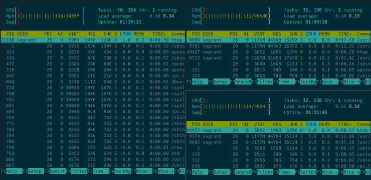

# This repository has been moved to [gitlab.com/paul-nechifor/vagrant-hadoop-cluster](http://gitlab.com/paul-nechifor/vagrant-hadoop-cluster).

Old readme:

# Vagrant Hadoop Cluster

A mini Hadoop cluster configuration in Vagrant with a variable number of slaves.

## Set Up

### In the project dir

By default, 3 slaves are used. Edit `nSlaves` in `Vagrantfile` to change it.

Bring up the machines:

    vagrant up

Log into the master:

    vagrant ssh master

### In master

From master, you have to connect to all the VMs. Run this script which loops
through all the SSH authentications. Exit every one. In this case, 3 represents
the number of slaves used by default.

    bash /vagrant/scripts/provision.sh ssh-checkin 3

Format the name node:

    hadoop namenode -format

Start everything:

    start-all.sh

Check the web interface at [10.10.10.10:50070](http://10.10.10.10:50070).

## Examples

Test if everything is okay right by running a simple MapReduce task.

    vagrant ssh master
    cd /vagrant/examples/word-count
    bash make.sh

## License

MIT
